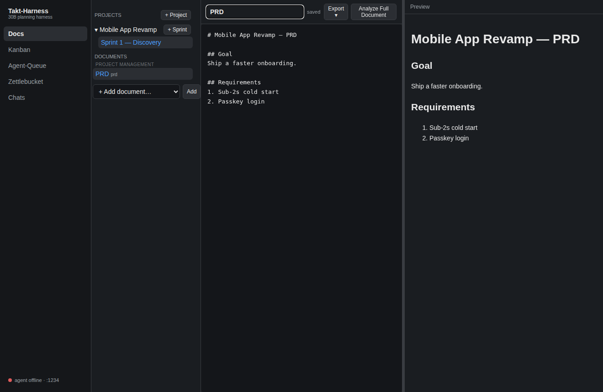
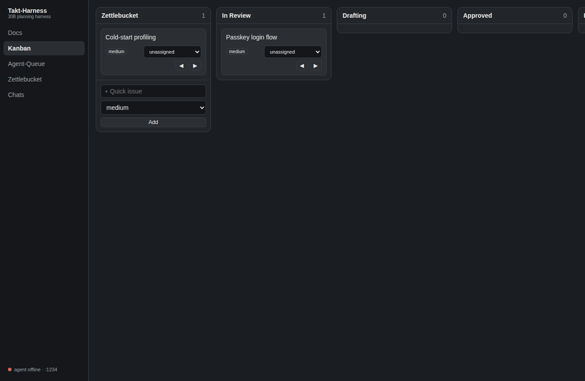
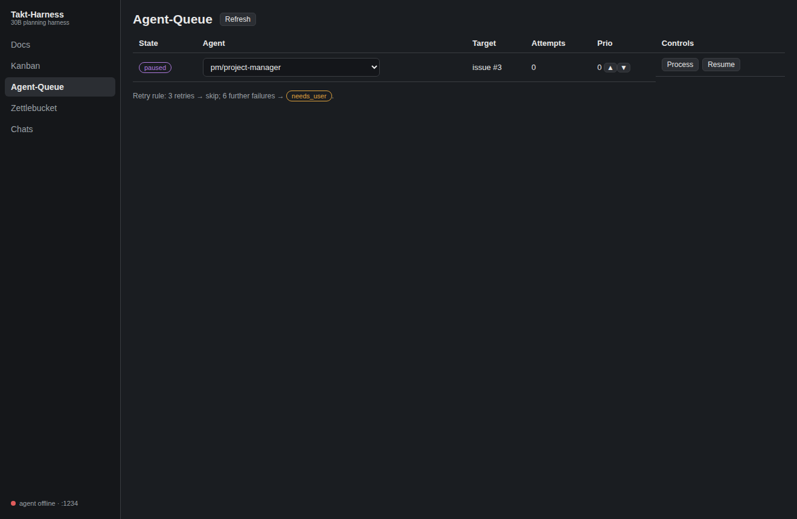
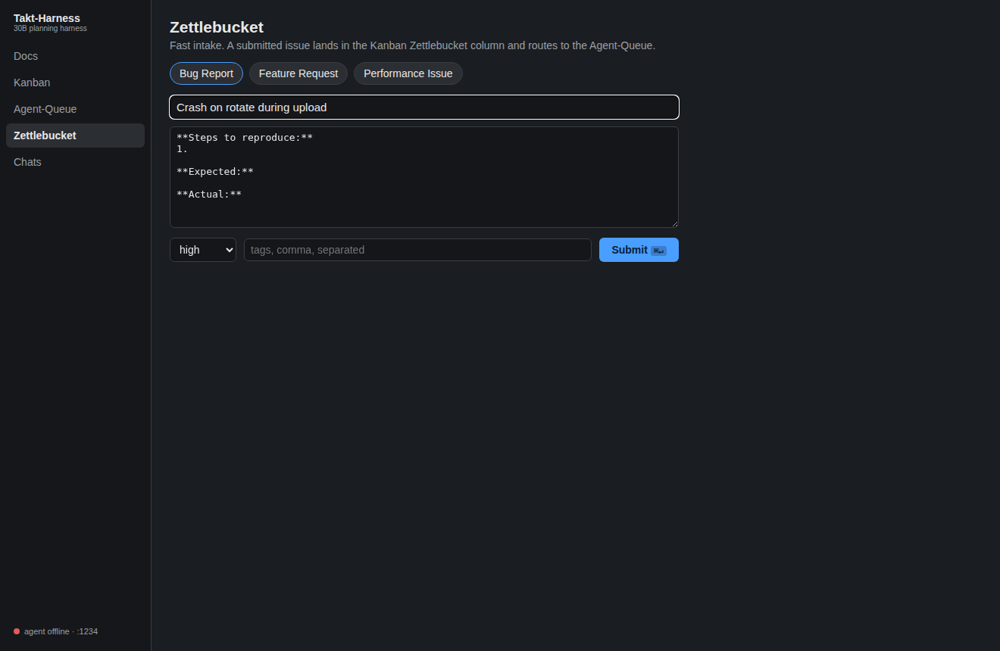
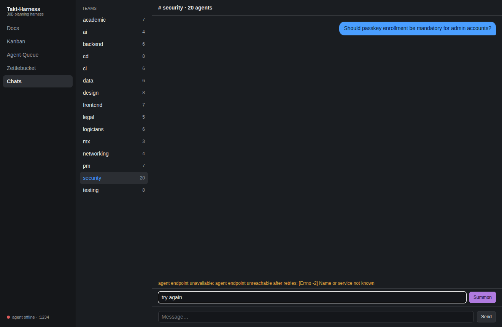
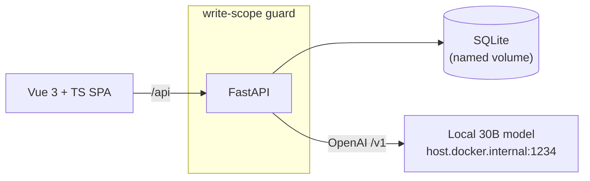

# Takt-Harness

**A locally-hosted planning harness for a small model.** Takt-Harness drives a
**30B-parameter model** — served over an OpenAI-compatible `/v1` endpoint on
port **1234** (LM Studio / llama.cpp / vLLM) — through a **roster of 105
specialist agents** to help you think a project plan all the way through
*before* expensive engineering starts.

Five interfaces, one Dockerized app, its own SQLite-backed agent roster, and no
runtime dependency on any external repo.

```
Intake ──▶ Zettlebucket ──▶ Agent-Queue ──▶ Kanban pipeline ──▶ Docs
  (idea)      (triage)      (who iterates)   (In Review→…)    (the plan)
                    ╲                                          ╱
                     ╰────────────  Chats (team debates)  ────╯
```

---

## The five interfaces

### 📝 Docs — the core value proposition
Projects → sprints → a **25-type document library organized into 7 categories**
(Intake, Project Management, Design, Engineering, Development, Testing,
Deliverables/Standards). A draggable **split editor** renders markdown **and
Mermaid** live, sanitized against XSS with DOMPurify, auto-saves (30 s + on
blur), and scrolls independently with generous bottom padding. Titles are
**unique per sprint** (with a suggested alternative on conflict) and renamable
inline. **Ask an agent inline** about a highlighted selection (floating
button + ⌘/Ctrl-K) or **Analyze the Full Document** from the toolbar; responses
appear in a collapsible panel. **Export** any document as Markdown or PDF.



### 🗂 Kanban — the planning pipeline
Unassigned issues start in the **Zettlebucket** column and move through
`In Review → Drafting → Approved → Implemented`. Assign to a project, move by
drag-and-drop or keyboard-friendly nav buttons; the board scrolls horizontally.



### 🤖 Agent-Queue — who iterates next
A live dashboard of which agent is assigned to which line item, with
color-coded states and manual controls (reassign, reprioritize, pause/resume,
process). The retry rule is exactly the spec: **retry 3× → skip to next → after
6 more failures, escalate to `needs_user`.**



### ⚡ Zettlebucket — fast intake
Templates for bug / feature / performance, a minimalist form, and `⌘/Ctrl+Enter`
to submit. Submitting creates an issue **and routes it to the Agent-Queue** for
`pm/project-manager` triage — the intake→queue→board pipeline, wired end to end.



### 💬 Chats — team breakout rooms
Every team is a room (iOS-Messages layout: you on the right, agents on the
left). A **summon is model-driven and single-active per room**: your prompt goes
to the model first, it chooses which agents to summon, those are queued in the
Agent-Queue, and a **"Summon Active"** badge gates further summons until it
completes. Summoned agents then join the back-and-forth. Persistent history.



---

## Agents live in SQLite — self-contained, editable, small-model-native

The harness **owns its roster** in an `agents` table rather than reading any
external repo at runtime. Ges-Talt targets frontier models; this is a harness
for a smaller local one, so it carries its own roster you can edit.

| column | meaning |
|---|---|
| `id` | `team/role` slug (e.g. `security/senior-secops`) |
| `team`, `title` | grouping + human role name |
| `actions` | the role's responsibilities (JSON) |
| `skills`, `tools` | capability lists (JSON) |
| `model` | which local model to route to |
| `system_prompt` | the charter passed to the `/v1` route |

It is seeded once from the former roster into `backend/app/agents_seed.json`
(regenerate with `backend/scripts/gen_agents_seed.py`), then edited here.
**An agent row is the unit passed to the model:**

```
POST /api/agents/{id}/invoke     # build_system_prompt(row) → local /v1 → reply
```

Verified content: **105 agents across 15 teams**, zero empty
titles/prompts/actions, 4–7 actions each, every row renders a usable `/v1`
system prompt.

---

## Architecture



- **Write invariant** (PRD acceptance #2): every filesystem write goes through
  `backend/app/guard.py`; anything resolving outside the `takt-harness/` data
  tree (traversal, absolute, symlink) is rejected. Proven by tests.
- **Model-interchangeable**: the model is always a parameter; retries use
  exponential backoff.

## Tech stack

FastAPI · SQLAlchemy · SQLite · Vue 3 + TypeScript (Vite) · marked + DOMPurify +
Mermaid · Playwright · Docker Compose.

## Run

```bash
docker compose up --build          # web on :8000
```
Run your model server (LM Studio / llama.cpp / vLLM) exposing
`http://localhost:1234/v1`; the container reaches it via `host.docker.internal`.

**Dev:**
```bash
cd backend && python -m venv .venv && . .venv/bin/activate && pip install -r requirements.txt
uvicorn app.main:app --reload --port 8000
cd web && npm install && npm run dev      # :5173, proxies /api → :8000
```

## Tests

```bash
cd backend && pytest         # 12 tests: write-scope guard, agents seed, queue retry rule
cd web && npm run typecheck  # vue-tsc
cd web && npm run test:e2e   # 4 Playwright specs across all five interfaces
```

The Playwright suite boots the real backend + frontend and drives each
interface end to end (it also produces the screenshots above).

## Project layout

```
backend/
  app/guard.py            write-scope invariant (the only module that writes)
  app/roster.py           DB-backed roster + build_system_prompt (→ /v1)
  app/queue_rules.py      retry/skip/escalation state machine (unit-tested)
  app/agents_seed.json    105 agents, self-contained (generated, committed)
  app/routers/            docs · kanban · queue · zettel · chats · agents
  tests/                  guard · agents · queue-rules
web/
  src/components/         DocsView · KanbanView · QueueView · ZettelView · ChatsView
  e2e/                    Playwright specs (also capture docs/screenshots/)
docs/
  prd.md · issue-specs/ · backlog.md    decomposed by pm/project-manager
  screenshots/            the images above
docker-compose.yml
```

## Acceptance criteria (PRD §Acceptance)

- ✅ **Writes scoped to Takt-Harness** — enforced by `guard.py`, tested.
- ✅ **Docker Compose deployment** — `docker compose up --build`.
- ✅ **Agent endpoint** — OpenAI `/v1` at :1234, reached from the container.
- ✅ **Docs split editor** — draggable divider, live markdown, auto-save.
- ✅ **Self-contained roster** — agents in SQLite; no external repo read at runtime.
